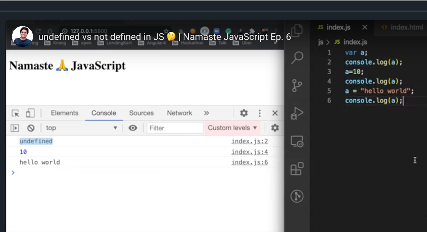

# E6 - undefined vs not defined in JS 🤔

- **undefined** is very special keyword in JS language

- Run below JS code to understand undefined

  - ```javascript
    var userName;

    if (userName === undefined) {
      console.log("userName is undefined");
    } else {
      console.log(
        "userName is not undefined, which is assigned some value to userName"
      );
    }

    // assign some value to userName
    userName = "Praveen";

    if (userName === undefined) {
      console.log("userName is undefined");
    } else {
      console.log(
        "userName is not undefined, which is assigned some value to userName"
      );
    }
    ```

- Undefined comes into picture during memory allocation phase, before starts executing the code

  - 

  - **<mark>undefined is like placeholder placed in the memory</mark>** during JS variables memory allocation, until assign some values to JS variables

- **<mark>undefined is completely different from not defined</mark>**

  - **not defined** will get which is not allocated memory to variables or functions
  - 

- **<mark>JS is loosely typed / weakly typed language, since JS does not attach its variable to any specific data types. JS is very flexible to changes its data types for variable, calling as dynamically typed language</mark>**

  - 

- Never do the mistake by assigning “undefined” to variable, not a good practice
  ```javascript
  var userName = undefined; // not recommended
  ```
